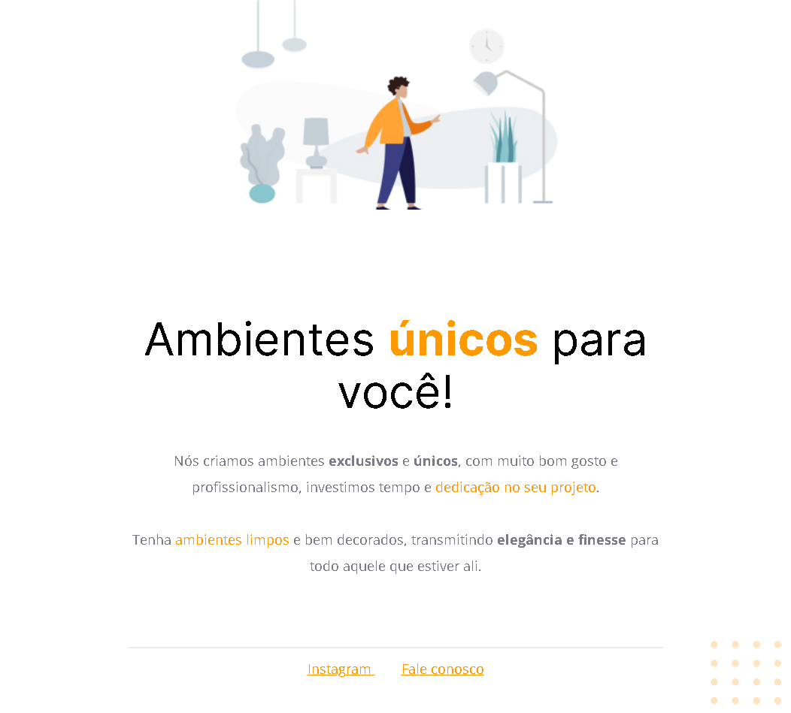

 <h1 align="center">Móveis Costumizados - Desafio 01 🚀</h1>
 
 
 
 <h2>💻 Desafio:</h2>
 

   Primeiro projeto proposto no curso Explorer da Rocketseat.
    
   Móveis costomizados é apenas uma página web simples para uma empresa fictícia de venda de móveis.
    
   <a href="https://main--silly-brioche-5de51e.netlify.app/">
     Acesse o projeto aqui
   </a>
 

<h2>🤯 Aprendizados:</h2>
<ul>
  <li>Figma básico;</li>
  <li>Introdução ao HTML5: suas tags, atributos e etc;</li>
  <li>CSS - Sintaxe, Propriedades e seus valores, alinhamentos e posicionamentos.</li>
  <li>VSCode - Como fazer a Estruturação do projeto, organizando os arquivos e pastas;</li>
  <li>Uso do <a href="https://fonts.google.com">Google Fonts;</a></li>
  <li>Criação de repositório no GitHub</li>
</ul>

<h2>🛠 Tecnologias utilizadas no Projeto:</h2>
<ul>
  <li>HTML</li>
  <li>CSS</li>
  <li>Git e GitHub</li>
</ul>

<h2>🎨 Layout do projeto</h2>

  Este é o <a href="https://www.figma.com/file/dZwREQYzGOFsCjEoObp5Mx/Explorer---Projeto-01-(Copy)?node-id=0%3A1&t=sMfD75Hlfo1V8SKh-0">layout do projeto</a> no Figma.

---

<table align="center">
  <tr>
    <td>
      
    </td>
    <td>
      
    </td>
    <td>
      Feito por <a href="https://github.com/barbcastro">Barbara Castro</a> 🙋🏽‍♀️
        Junto com <a href="https://rocketseat.com.br">Rocketseat</a> 🚀.
    </td>
  </tr>
</table>
