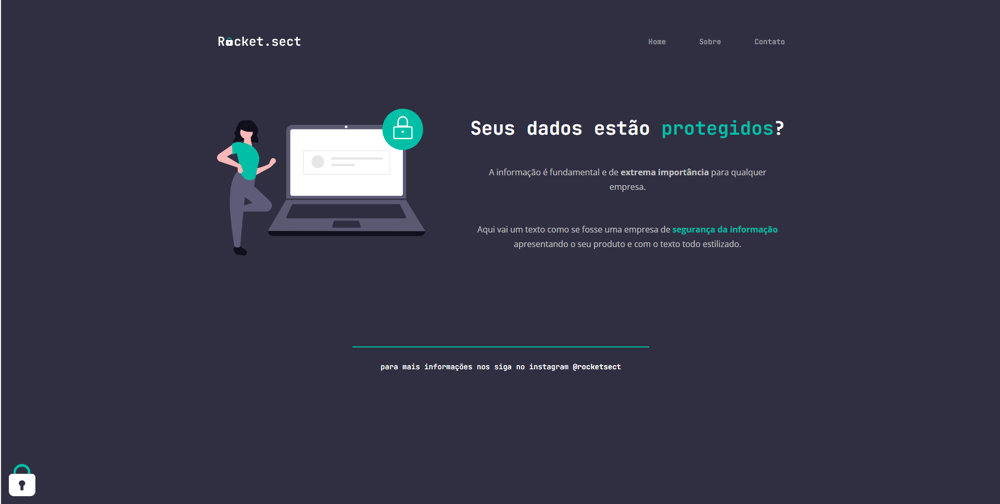

<h1 align="center">Rocket.sect - Desafio 03 🔒</h1>
 
 
 
 <h2>💻 Desafio:</h2>
 

   Terceiro projeto proposto no curso Explorer da Rocketseat.
    
   Nesse desafio, recriei uma aplicação, a partir de um layout, para treinar o que aprendi até agora no Stage 01 e 02.
   Então desenvolvi uma página web simples fictícia para uma empresa de segurança da informação.
    
   <a href="https://6446c2de568d20204ea93787--papaya-queijadas-201381.netlify.app/">
     Acesse o projeto aqui
   </a>
 

<h2>🤯 Aprendizados:</h2>
<ul>
  <li>Semântica HTML;</li>
  <li>Acessibilidade;</li>
  <li>Estilização com cores e fontes;</li>
  <li>Flexbox;</li>
</ul>

<h2>🛠 Tecnologias utilizadas no Projeto:</h2>
<ul>
  <li>HTML;</li>
  <li>CSS;</li>
  <li>Git e GitHub.</li>
</ul>

<h2>🎨 Layout do projeto</h2>

  Este é o <a href="https://www.figma.com/file/yz0tiRmBP3vwcHFb3w2sZs/Explorer-(Copy)?node-id=0-1&t=IQbzaWniwac4CB8n-0">layout do projeto</a> no Figma.

---

<table align="center">
  <tr>
    <td>
      
    </td>
    <td>
      Feito por <a href="https://github.com/barbcastro">Barbara Castro</a> 🙋🏽‍♀️
    </td>
  </tr>
</table>
