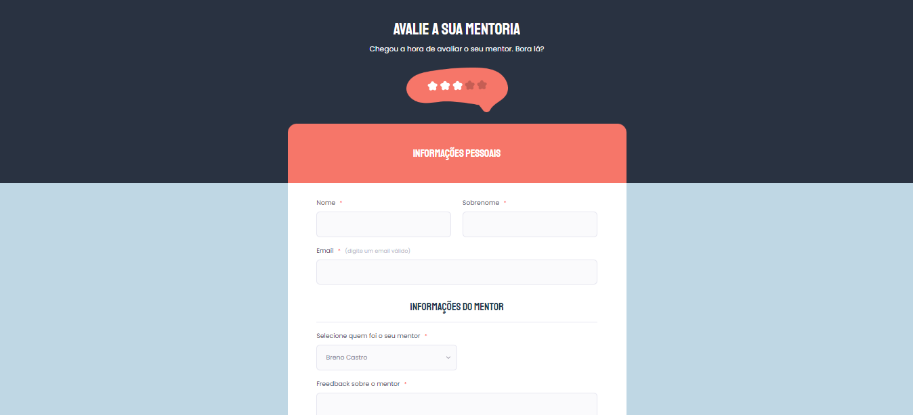

<h1 align="center">Avalie sua Mentoria📋 - Desafio 01 🚀</h1>

 

## 📝 O Desafio:
Criei uma página web de Formulário de avaliação de uma mentoria, que é um formulário fictício para avaliação de uma mentoria. 
Colocando em prática todos os aprendizados anterior para a criação de formulários📋

<a href="https://avaliesuamentoria.netlify.app/">
     Acesse o projeto aqui
   </a>

 

## 🤯 Aprendizados:
 - Como funcionam os formulários no HTML ;
 - Trabalhar com inputs no HTML ;
 - Trabalhar com _pseudo-elements_ no CSS ;
 - Validar campos de formulários.

 

##  🛠 Tecnologias utilizadas no Projeto:
- HTML ;
- CSS ;
- Git e GitHub.

 

##  🎨  Layout do projeto:
Este é o [layout do projeto](https://www.figma.com/file/nsrDh2hcHfUCTB51rCYxmk/Stage-03---Formul%C3%A1rio-avan%C3%A7ado-(Copy)?type=design&node-id=0-1&t=TjwEfHLsk4cb2ROA-0) no Figma.

---

 
<table align="center">
  <tr>
    <td>
      
    </td>
    <td>
      
    </td>
    <td>
      Feito por <a href="https://github.com/barbcastro">Barbara Castro</a> 🙋🏽‍♀️
    </td>
  </tr>
</table>
